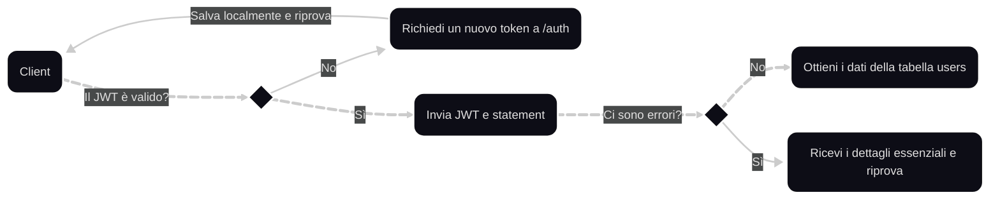

# Documentazione ufficiale del servizio API di Zexa

> [!CAUTION]
> 
> Attenzione: al momento non vi è presente alcun sistema per registrarsi ed usare effettivamente la API, questa repository verrà aggiornata parallelamente allo sviluppo dell'interfaccia che verrà usata per il sito Zexa.

  

## Cosa è Zexa API?

Zexa API è uno dei diversi servizi che offre Zexa, che consiste nella gestione centralizzata dei dati di diversi utenti in un unico database. Il mio obiettivo è quello di offrire un servizio che sia facile da usare, ma allo stesso tempo sicuro ed economico.

  

## Come posso usufruirne?

Per usufruire di questo servizio è necessario un pagamento. Al momento non esiste un sito o una pagina web con cui si può fare la registrazione, ma per creare un account ed ottenere uno spazio dedicato è possibile contattare privatamente [questo account discord](https://discord.com/users/730376049317249087), per cui è possibile dover aspettare fino a 48 ore per la finalizzazione.

Una volta ricevuto il token, l'utente lo potrà inserire dove indicato nel progetto.

> [!WARNING]
>
> Il token fornito è strettamente personale e non dovrebbe essere condiviso in nessuna circostanza. Una divulgazione non autorizzata potrebbe comportare a una fuga di dati associati al tuo account. Le responsabilità viene ceduta una volta completata la registrazione.

  

## È un servizio affidabile?

Metto la sicurezza dei clienti e dei loro dati al primo posto, assicurandomi di sviluppare sistemi di sicurezza adeguati. È comunque possibile eseguire dei test di sicurezza se si vuole collaborare allo sviluppo, per più informazioni è possibile contattare [questo account discord](https://discord.com/users/730376049317249087).

  

## Esempi di utilizzo

TODO
Per visualizzare degli esempi di utilizzo, visitare [la loro pagina](palle).

## Funzionamento della API

Capire al meglio come funziona l'API è fondalmentale per assicurare sicurezza, rapidità e semplicità. Per questo motivo è possibile visualizzare il flusso dei dati nella API sottoforma di mappa mentale, dove in questo caso si simula la richiesta di un token JWT e si tenta di ottenere dati dalla tabella `users`. In grassetto tratteggiato il flusso di dati aspettato.

### Flusso di dati lato client

