# Documentazione ufficiale del servizio API di Zexa

> [!CAUTION]
>
> Attenzione: al momento non vi è presente alcun sistema per registrarsi ed usare effettivamente la API, questa repository verrà aggiornata parallelamente allo sviluppo dell'interfaccia che verrà usata per il sito Zexa.

## Cosa è Zexa API?

Zexa API è uno dei diversi servizi che offre Zexa, che consiste nella gestione centralizzata dei dati di diversi utenti in un unico database. Il mio obiettivo è quello di offrire un servizio che sia facile da usare, ma allo stesso tempo sicuro ed economico.

## Come posso usufruirne?

Per usufruire di questo servizio è necessario un pagamento. Al momento non esiste un sito o una pagina web con cui si può fare la registrazione, ma per creare un account ed ottenere uno spazio dedicato è possibile contattare privatamente [questo account discord](https://discord.com/users/730376049317249087), per cui è possibile dover aspettare fino a 48 ore per la finalizzazione.

Una volta ricevuto il token, l'utente lo potrà inserire dove indicato nel progetto.

> [!WARNING]
>
> Il token fornito è strettamente personale e non dovrebbe essere condiviso in nessuna circostanza. Una divulgazione non autorizzata potrebbe comportare a una fuga di dati associati al tuo account. Le responsabilità viene ceduta una volta completata la registrazione.

## È un servizio affidabile?

Metto la sicurezza dei clienti e dei loro dati al primo posto, assicurandomi di sviluppare sistemi di sicurezza adeguati. È comunque possibile eseguire dei test di sicurezza se si vuole collaborare allo sviluppo, per più informazioni è possibile contattare [questo account discord](https://discord.com/users/730376049317249087).

## Esempi di utilizzo

TODO

Per visualizzare degli esempi di utilizzo, visitare [la loro pagina](palle).

## Funzionamento della API

Capire al meglio come funziona l'API è fondalmentale per assicurare sicurezza, rapidità e semplicità. Per questo motivo è possibile visualizzare qui sotto i punti più importanti che servono per comprendere il servizio.
### Esempio di flusso di dati
In grassetto il flusso ottimale.

```mermaid

---

config:

theme: redux-dark

---

flowchart LR

subgraph s1["Gestione JWT client"]

n3["È valido?"]

n4["Sì"]

n5["No"]

n6["Continua ad usarlo"]

n9["Richiedine uno nuovo"]

n12["Controlla il token"]

end

subgraph s2["Generazione JWT"]

n10["Recupero payload"]

n13["Completamento payload con i dati del client"]

n14["Codifica il payload e restituisci il JWT"]

end

subgraph s3["Esecuzione statement"]

n16["Controllo degli argomenti ricevuti"]

n17["Controllo utente nel database"]

n18["Interpretazione dello statement ricevuto"]

n20["Validazione dello statement"]

n21["Esecuzione dello statement e controllo dei dati ricevuti dal database"]

n22["Restituzione dei dati"]

end

subgraph s4["Risposta"]

n23["Ricezione dei dati, parametri e della lingua"]

n24["Costruzione risposta in JSON"]

n25["Ritardo programmato casuale"]

n26["Log dei dati nel database ed invio risposta"]

n27["Impostazione del codice HTTP della risposta"]

end

n3 L_n3_n4_0@==> n4

n3 --> n5

n4 L_n4_n6_0@==> n6

n5 --> n9

n2["Client"] L_n2_s1_0@==> s1

n1["Server"] --> s2 & s3 & s4

n9 --> n11["Richiesta POST a /auth"]

n11 --> s2

n12 L_n12_n3_0@==> n3

n13 --> n14

n10 --> n13

n6 L_n6_n15_0@==> n15["Richiesta POST a /query"]

s2 --> n15 & s4

n15 L_n15_s3_0@==> s3

n16 L_n16_n17_0@==> n17

n17 L_n17_n18_0@==> n18

n18 L_n18_n20_0@==> n20

n20 L_n20_n21_0@=== n21

n21 L_n21_n22_0@==> n22

n23 L_n23_n24_0@==> n24 & n27

n25 L_n25_n26_0@==> n26

n24 L_n24_n25_0@==> n25

s3 L_s3_s4_0@==> s4

s4 L_s4_n2_0@==> n2

n3@{ shape: rect}

n4@{ shape: text}

n5@{ shape: text}

n12@{ shape: rect}

n13@{ shape: rect}

n2@{ shape: rect}

n1@{ shape: rect}

n15@{ shape: rect}

style n2 fill:#2962FF

style s1 fill:#424242

style n1 fill:#2962FF

style s2 fill:#424242

L_n3_n4_0@{ animation: slow }

L_n4_n6_0@{ animation: slow }

L_n2_s1_0@{ animation: slow }

L_n12_n3_0@{ animation: slow }

L_n6_n15_0@{ animation: slow }

L_n15_s3_0@{ animation: slow }

L_n16_n17_0@{ animation: slow }

L_n17_n18_0@{ animation: slow }

L_n18_n20_0@{ animation: slow }

L_n20_n21_0@{ animation: slow }

L_n21_n22_0@{ animation: slow }

L_n23_n24_0@{ animation: slow }

L_n23_n27_0@{ animation: slow }

L_n25_n26_0@{ animation: slow }

L_n24_n25_0@{ animation: slow }

L_s3_s4_0@{ animation: slow }

L_s4_n2_0@{ animation: slow }

```



## Elementi necessari per i clienti

Come già detto, e come visto [qui](#esempio-di-flusso-di-dati), per usufruire di questo servizio non basta inviare una richiesta all'[endpoint root](https://codesignal.com/learn/courses/introduction-to-fastapi-basics/lessons/defining-the-root-endpoint) della API, ma c'è bisogno di ottenere prima un JWT, necessario per semplificare la comunicazione e l'autenticazione. Qui di sotto ci sono gli elementi che si devono avere nel proprio progetto per far sì che si possa usufruire della API:

 - **Il token di autenticazione** ottenuto una volta comprato uno spazio personale nel database ed inviato all'endpoint `/auth`. Attenzione: se un malintenzionato entra in possesso di questo token, esso lo può utilizzare per autenticarsi come il proprietario legittimo.
 - **Il JWT** generato automaticamente dal server una volta autenticato con successo l'utente, serve per autenticarsi in tutti gli altri endpoint. Diventa inutile dopo 900 secondi (15 minuti) dal momento della generazione, e se ne dovrà richiedere un altro per proseguire con l'utilizzo.
 - **Lo statement** serve per comunicare al database tramite il server nell'endpoint `/query`. Si noti che per ogni statement è possibile eseguire una sola query, **ed ogni tentativo di [subquery](https://www.geeksforgeeks.org/sql-subquery/) o di uso di azioni peicolose (DROP, ALTER, CREATE, SLEEP, ...) rilevato viene tracciato e trattato come un tentato attacco informatico**. Inoltre, gli unici metodi permessi sono SELECT, INSERT, DELETE, UPDATE e COUNT. Si noti infine che lo statement viene accettato solo se in forma di `prepared statement`.
 - **Gli argomenti** in `/query` sono passati assieme allo statement sottoforma di array contenente i dati, usati poi dal server per costruire lo statement finale. Il contenuto di questo array deve essere di un elemento "table_name" e uno "more", si guardi sotto per capire meglio. Attenzione: il numero di argomenti deve corrispondere a quello dei ? nello statement inviato dal client.

Ecco una tabella riassuntiva:

|Nome elemento|Scopo|Come si ottiene|
|:--:|:--:|:--:|
|Token d'autenticazione|Autenticare l'utente|Comprandolo|
|JWT|Facilitare l'uso della API|Usando il token d'autenticazione|
|Lo statement|Comunicare col database|Scelto dal cliente|
|Gli argomenti|Rendere dinamica la richiesta|Scelto dal cliente|

### Esempio completo di richiesta a /query

Esempio scritto in PHP
```PHP
$arguments = json_encode([
  "table_name" => "products",
  "more" => [
    "prezzo",
    "sconto"
  ]
]);

$token = request_new_jwt("token personale super segreto");
echo execute_statement("SELECT  *  FROM ? WHERE ? <  5  OR ? >  25",  $arguments,  $token,  true);
```

TODO: parlare del server, come per esempio gli endpoint
> [!NOTE]
> 
> Questo file è ancora in fase di scrittura e verrà continuato
